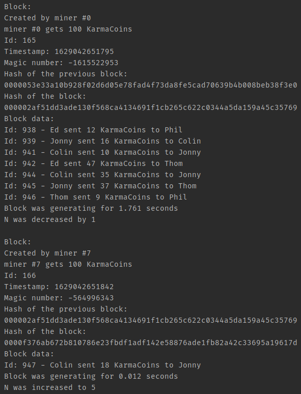

<h1>Blockchain</h1>

Blockchain implementation with following characteristics:

- Ability to store transactions between users.
- Mining reward for each block added to the blockchain.
- Proof of work with magic number self-balancing hashing.
- SHA-256 algorithm based hashing.

Main method allows to test it by creating fake miners, and it is also included a transaction generator to mock a series of users interacting each other.
Execution example:

  